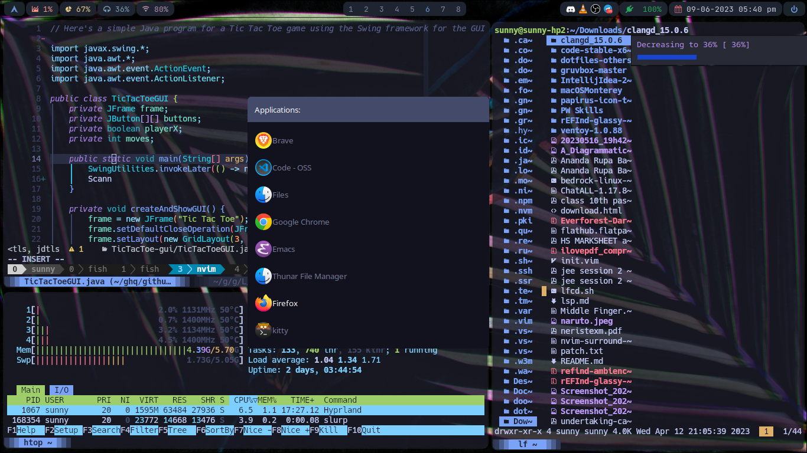
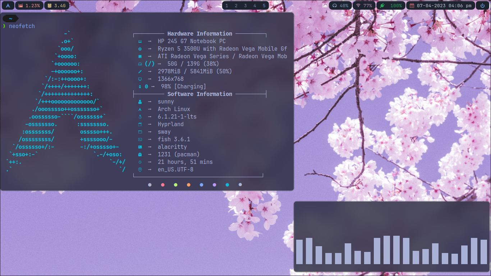
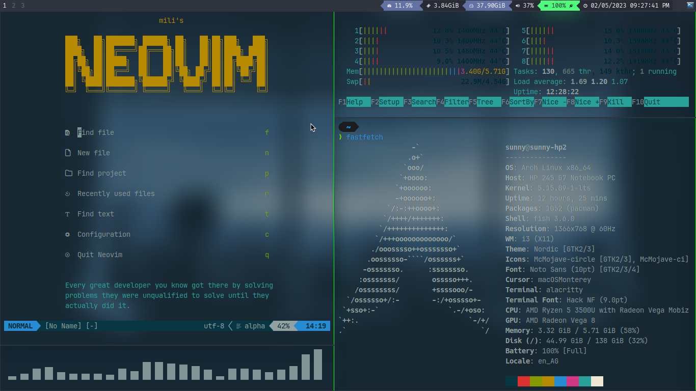
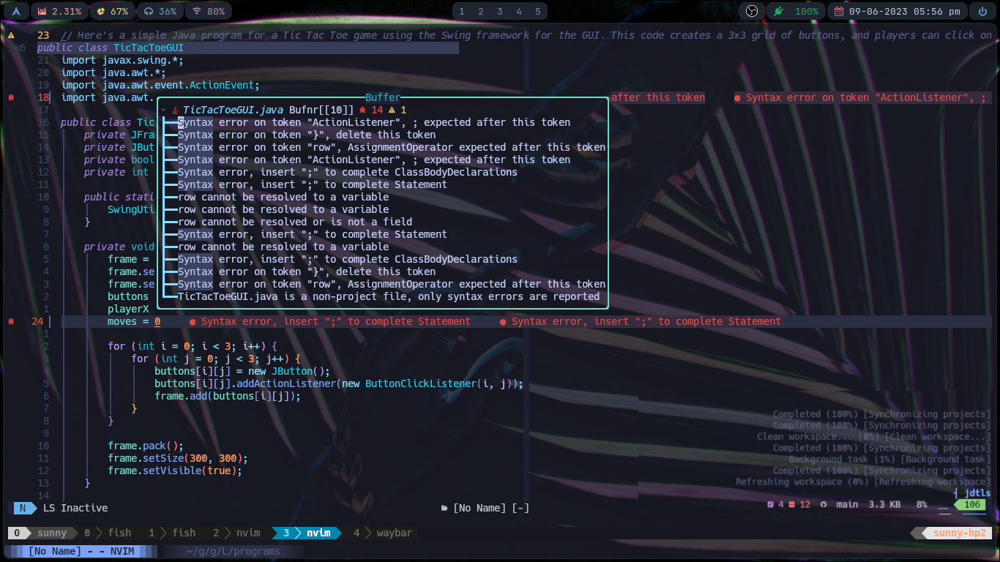

<h1>💻 DOTFILES</h1>
These are my personal dotfiles for mainly my Arch-Linux machine 

---

- They are in this unusual dir order due to my symlink style configuration for using **GNU/STOW** in order to make my life easier since I am using version control to maintain and backup these stuff.
- I use **[GNU/Stow](https://www.gnu.org/software/stow/)** to manage my dotfiles as well as keep track of them in GitHub using Git.
- Here I have a few configs of free and open source softwares as the directory names suggests
- I have gotten a lot of help while setting them up from StackOverflow; reddit pages like [r/neovim](https://www.reddit.com/r/neovim/), [r/linux](https://www.reddit.com/r/linux/), [r/linuxmasterrace](https://www.reddit.com/r/linuxmasterrace/), [r/archlinux](https://www.reddit.com/r/archlinux/), [r/linux4noobs](https://www.reddit.com/r/linux4noobs/), [r/linuxquestions](https://www.reddit.com/r/linuxquestions/); and Google.
- Copied a lot of stuff from the one and only [UNIXPORN](https://www.reddit.com/r/unixporn/)
- ChrisTitusTech, Brodie-Robertson

## [UNIXPORN](https://www.reddit.com/r/unixporn/) stuff (tiling window managers) _just for fun_

### Hyprland rice

- Waybar is from [s1mpleman](https://github.com/1amSimp1e/dots)

### i3wm rice

<h1 align="center">Neovim configuration 🖐️on🔥</h1>

<!--  -->

- I use NEOVIM(a better version of vim, more appropiately a better fork) because it is one of the best editor I have ever used. I have configured it to my liking with all the keybinds ready to use so that my hands remain in the keyboard. There are still some extension left.
- Don't go for the exit vim memes, they're bluff. Use it to its full potential in its vanilla state and you will realise the power of vim, the legendary text editing abilities it provides. Start from here [freecodecamp.org/Vim-tutorial-for-beginners](https://youtu.be/RZ4p-saaQkc), then go for more improvements using channels like [ThePrimeagen][ThePrimeagen], etc.
- I have already setup formatting and linting(maybe) using the linters and formatters provided by mason from this [repo](https://github.com/leonasdev/.dotfiles).
- TODOS:
  - [ ] Configure DAP for java, cpp, and other languages to be used later on. 
  - [ ] make the ui better with the transparency and stuff.
  - [ ] setup formatting and linting for more languages.

---
### 😎 The following are the legendary people of the Neovim users/community.
- **[ThePrimeagen][ThePrimeagen] is the legendary vimmer, he made me step into nvim/vim. One of the best channel, also twitches**.
- **[TJDevries](https://www.youtube.com/tjdevries) is another legendary vimmer, and the core maintainer of Neovim, has a great channel, also twitches**.
- **[Devaslife](https://www.youtube.com/devaslife) is the vimmer dev, he primarily uses nvim and I follow him a lot. His frontend and backend vids are amazing**.
- **The [r/neovim](https://www.reddit.com/r/neovim/) reddit page, google helped of course**.
They helped me setup nvim like the one you see in the pics
---

### ⚡️Requirements
1. **This configuration requires [Neovim](https://neovim.io/) (>= 0.8)**
2. Nerd Fonts (**>= 3.0!!**):
    - Any Nerd Font is required to display the glyph correctly.
    - [ryanoasis/nerd-fonts](https://github.com/ryanoasis/nerd-fonts)
    - **[JetBrains Mono NL](https://github.com/ryanoasis/nerd-fonts/tree/master/patched-fonts/JetBrainsMono/NoLigatures) is recommended or you can use the [ligature](https://github.com/ryanoasis/nerd-fonts/tree/master/patched-fonts/JetBrainsMono/Ligatures) version.**
3. Node (>=16.20.0) & Npm: Use [nvm]()
4. Python (>=3.9) & pip
5. Cmake - for building some plugins
6. GCC (recent versions) - for building some plugins
7. [fd](https://github.com/sharkdp/fd) - A better version of find(linux util) in rust of course, improves performance in some plugins
8. [ripgrep(rg)](https://github.com/BurntSushi/ripgrep) - A better version of grep(linux util) in rust of course, improves performance in some plugins
9. [jfind](https://github.com/jake-stewart/jfind.nvim) - A wayy faster version of fzf written in cpp, req for jfind.nvim

### 🔧 Plugins used
<!-- TODO: more plugins to be added -->

**UI** stuff
- [folke/lazy.nvim](https://github.com/folke/lazy.nvim) - The main thing, a **plugin manager** , Lazy. Legendary folke, tpope. Bootstraps everything, no need to configure. Change keymaps to your liking.
- [folke/tokyonight.nvim](https://github.com/folke/tokyonight.nvim) - A dark and light Neovim **theme/colorscheme** written in Lua ported from the VSCode's tokyonight theme.
  - other **colorschemes** include ones : 
    1. [svrana/neosolarized.nvim](https://github.com/svrana/neosolarized.nvim) - A truecolor, solarized dark colorscheme
    2. [gruvbox-community/gruvbox](https://github.com/gruvbox-community/gruvbox) - One of the legendary colorschemes **Gruvbox** 
- [nvim-lualine/lualine.nvim](https://github.com/nvim-lualine/lualine.nvim) - A blazing fast and easy to configure Neovim **statusline** written in Lua
- [kyazdani42/nvim-web-devicons](https://github.com/kyazdani42/nvim-web-devicons) - Lua `fork` of vim-web-devicons for neovim, for eyecandy **icons**
- [lewis6991/gitsigns.nvim](https://github.com/lewis6991/gitsigns.nvim) - **Git signs** for better tracking for buffers
- [folke/zen-mode.nvim](https://github.com/folke/zen-mode.nvim) - **Distraction-free mode**
- [goolord/alpha-nvim](https://github.com/goolord/alpha-nvim) - beautiful and highly customizable dashboard for Neovim
- [xiyaowong/transparent.nvim](https://github.com/xiyaowong/transparent.nvim) - make everything transparent with just one command
- [j-hui/fidget.nvim](https://github.com/j-hui/fidget.nvimm) - ui for nvim-lsp progress and some details
- [stevearc/dressing.nvim](https://github.com/stevearc/dressing.nvimm) - Neovim plugin to improve the default vim.ui interfaces.
- [RRethy/vim-illuminate](https://github.com/RRethy/vim-illuminate) - automatically highlighting other uses of the word under the cursor using either LSP, Tree-sitter, or regex matching.
- [eandrju/cellular-automaton.nvim](https://github.com/eandrju/cellular-automaton.nvim) - Screensaver using the text in the buffer
<!-- - [norcalli/nvim-colorizer.lua](https://github.com/norcalli/nvim-colorizer.lua) - A high-performance color highlighter -->
<!-- - [akinsho/nvim-bufferline.lua](https://github.com/akinsho/nvim-bufferline.lua) - A snazzy bufferline -->

**LSP** stuff 
  - [VonHeikemen/lsp-zero.nvim](https://github.com/VonHeikemen/lsp-zero.nvim#you-might-not-need-lsp-zero) - bundles all the boilerplate code req for lsp
  This lsp-zero repo helped me a lot to setup the LSP for every language I needed, I just need to install the right backend if needed (eg: rust, go, etc) and the correct LSP server itself and everything just works right out of the box. Java requires some extra configurations and I have done that too in ftplugin dir.  
  - [neovim/nvim-lspconfig](https://github.com/neovim/nvim-lspconfig) - A collection of configurations for Neovim's **built-in LSP**
  - [onsails/lspkind-nvim](https://github.com/onsails/lspkind-nvim) - VSCode-like **pictograms**
  - [L3MON4D3/LuaSnip](https://github.com/L3MON4D3/LuaSnip) - **Snippet Engine** for Neovim written in Lua
  - [hrsh7th/nvim-cmp](https://github.com/hrsh7th/nvim-cmp) - A **completion engine** plugin for neovim written in Lua
  - [hrsh7th/cmp-nvim-lsp](https://github.com/hrsh7th/cmp-nvim-lsp) - nvim-cmp **source** for neovim's built-in LSP
  - [hrsh7th/cmp-buffer](https://github.com/hrsh7th/cmp-buffer) - nvim-cmp source for **buffer** words
  - [jose-elias-alvarez/null-ls.nvim](https://github.com/jose-elias-alvarez/null-ls.nvim) - Use Neovim as a language server to inject LSP diagnostics, code actions, and more via Lua.
  - [williamboman/mason.nvim](https://github.com/williamboman/mason.nvim) - **Portable package manager** for Neovim that runs everywhere Neovim runs. Easily install and manage LSP servers, DAP servers, linters, and formatters
  - [williamboman/mason-lspconfig.nvim](https://github.com/williamboman/mason-lspconfig.nvim) - **Extension** to mason.nvim that makes it easier to use lspconfig with mason.nvim
  - [glepnir/lspsaga.nvim](https://github.com/glepnir/lspsaga.nvim) - A light-weight lsp plugin based on neovim's built-in lsp with a highly **performant UI**

  - _Language specific stuff_
  - If you don't want extra configuration's mental torture, just go for [neoclide/coc.nvim](https://github.com/neoclide/coc.nvim)
     1. for **JAVA** use [mfussenegger/nvim-jdtls](https://github.com/mfussenegger/nvim-jdtls), requires a hell lot of configuration
     2. more to be added in future

**Utilities** must have
- [nvim-treesitter/nvim-treesitter](https://github.com/nvim-treesitter/nvim-treesitter) - [Treesitter](https://github.com/tree-sitter/tree-sitter) configurations and abstraction layer for Neovim. Must have for **The best Syntax hightlighting**.
  - [windwp/nvim-ts-autotag](https://github.com/windwp/nvim-ts-autotag) - Use treesitter to **auto close** and **auto rename** html tag
- [nvim-telescope/telescope.nvim](https://github.com/nvim-telescope/telescope.nvim) - A highly extendable **fuzzy finder** for lsp stuff, grep, find_files,etc can be extended to make it a beast.
  - [nvim-telescope/telescope.nvim](https://github.com/nvim-telescope/telescope.nvim) - A highly extendable **fuzzy finder** for lsp stuff, grep, find_files,etc can be extended to make it a beast.
  - [debugloop/telescope-undo.nvim](https://github.com/debugloop/telescope-undo.nvim) - A telescope extension to **view and search**
  - [nvim-telescope/telescope-fzf-native.nvim](https://github.com/nvim-telescope/telescope-fzf-native.nvim) - as the name suggests
- [nvim-tree/nvim-tree](https://github.com/nvim-tree/nvim-tree) - **File Browser**
- [windwp/nvim-autopairs](https://github.com/windwp/nvim-autopairs) - **Autopairs** i.e autoclosing braces, quotes, etc.
- [tpope/vim-fugitive](https://github.com/tpope/vim-fugitive) - A **Git wrapper** so awesome, it should be illegal
- [tpope/vim-rhubarb](https://github.com/tpope/vim-rhubarb) - A **GitHub extension** for fugitive.vim
- [folke/which-key.nvim](https://github.com/folke/which-key.nvim) - A displays a **popup** with possible keybindings of the command you started typing.
- [folke/todo-comments.nvim](https://github.com/folke/todo-comments.nvim) - **highilighted comments** using special keywords very good looking and useful
- [folke/trouble.nvim](https://github.com/folke/trouble.nvim) - A **pretty diagnostics, references, telescope results, quickfix and location** list to help you solve all the trouble your code is causing.
- [iamcco/markdown-preview.nvim](https://github.com/iamcco/markdown-preview.nvim) - **Markdown live preview, like GitHub**
- [jake-stewart/jfind.nvim](https://github.com/jake-stewart/jfind.nvim) - **faster file search** alternative to fzf and telescope-fzf-native, trigger using ctrl + f, written in cpp.
- [szw/vim-maximizer](https://github.com/szw/vim-maximizer) - useful for **maximizing splits** or other split type buffers inside of a buffer.
- [luukvbaal/statuscol.nvim](https://github.com/luukvbaal/statuscol.nvim) - Status column plugin that **provides a configurable 'statuscolumn**' and click handlers**.
- [dstein64/vim-startuptime](https://github.com/dstein64/vim-startuptime) - measure nvim **startuptime** accurately
- [nmac427/guess-indent.nvim](https://github.com/nmac427/guess-indent.nvim) - **auto detect indentation**
- [lukas-reineke/indent-blankline.nvim](https://github.com/lukas-reineke/indent-blankline.nvim) - adds **indentation guides** to all lines (including empty lines)
- [echasnovski/mini.indentscope](https://github.com/echasnovski/mini.indentscope) - **active indent guide and indent text objects**
- [ThePrimeagen/vim-be-good](https://github.com/ThePrimeagen/vim-be-good) - A **game** made by [ThePrimeagen][ThePrimeagen] 
- [mbbill/undotree](https://github.com/mbbill/undotree) - **time travel undo**  for any file 
- [windwp/nvim-spectre](https://github.com/windwp/nvim-spectre) - **search/replace in multiple files** in a dir
- [NvChad/nvim-colorizer.lua](https://github.com/NvChad/nvim-colorizer.lua) - Better CSS hex(maybe others too) **color code representation** 
- [kylechui/nvim-surround](https://github.com/kylechui/nvim-surround) - Chad legendary level of editing using keybinds for any type of e**diting of surrounding tags/quotes/braces,etc**.
<!-- - [dinhhuy258/git.nvim](https://github.com/dinhhuy258/git.nvim) - A simple clone of the plugin vim-fugitive, will implement this later on for now I use the following -->

## 🐚 Shell setup (Linux) (shall also work in macOS)

- [Fish shell](https://fishshell.com/)
- [Fisher](https://github.com/jorgebucaran/fisher) - Plugin manager for fish
- [Tide](https://github.com/IlanCosman/tide) - Shell theme. Use version 5: `fisher install ilancosman/tide@v5`
- [Nerd fonts](https://github.com/ryanoasis/nerd-fonts) - Powerline-patched fonts. I use JetBrainsMono NF.
- [z](https://github.com/jethrokuan/z) - Directory jumping using `z a-folder-name`
- [Exa](https://the.exa.website/) - better `ls` replacement
- [ghq](https://github.com/x-motemen/ghq) - Local Git repository organizer
- [peco](https://github.com/peco/peco) - Interactive filtering

## 🤮 PowerShell setup (Windows), is in another [repo](https://github.com/LegioN2004/some-other-stuff/tree/main/Windows/PowerShell7)

- Made a lot of unix style commands aliased in powershell.
- [Scoop](https://scoop.sh/) - A command-line installer
- [Git for Windows](https://gitforwindows.org/)
- [Terminal Icons](https://github.com/devblackops/Terminal-Icons) - Folder and file icons
- [PSReadLine](https://docs.microsoft.com/en-us/powershell/module/psreadline/) - Cmdlets for customizing the editing environment, used for autocompletion
- [z](https://www.powershellgallery.com/packages/z) - Directory jumper
- [PSFzf](https://github.com/kelleyma49/PSFzf) - Fuzzy finder
<!-- 2. - [Oh My Posh](https://ohmyposh.dev/) - Prompt theme engine -->

## ✅ How to use

Watch these video tutorials of [devaslife](https://www.youtube.com/devaslife):

1. highly recommended for [setting up nvim](https://youtu.be/w7i4amO_zaE) from scratch - I also took a lot from this
2. dev workflow using tmux and vim [ThePrimeagen version](https://youtu.be/bdumjiHabhQ)
3. how to use nvim by ThePrimeagen, some recent vids highly recommended [first](https://youtu.be/X6AR2RMB5tE) and [second](https://youtu.be/FrMRyXtiJkc)
2. dev workflow using tmux and vim [devaslife version](https://www.youtube.com/watch?v=sSOfr2MtRU8&list=PLxQA0uNgQDCICMRwlOzWAZBPL05XBC_br&index=10)
4. [Fish shell workflow for coding](https://www.youtube.com/watch?v=KKxhf50FIPI)
5. [How to set up PowerShell prompt with Oh My Posh on Windows 11](https://www.youtube.com/watch?v=5-aK2_WwrmM)
<!-- 2. [vim setup to speed up JavaScript coding for my Electron and React Native apps](https://www.youtube.com/watch?v=UZBjt04y4Oo&list=PLxQA0uNgQDCICMRwlOzWAZBPL05XBC_br&index=3) -->
<!--    - [Blogpost](https://dev.to/craftzdog/my-vim-setup-to-speed-up-javascript-coding-for-my-electron-and-react-native-apps-4ebp) -->
<!-- 3. [A productive command-line Git workflow for indie app developers](https://www.youtube.com/watch?v=qKpY7t5m35k&list=PLxQA0uNgQDCICMRwlOzWAZBPL05XBC_br&index=4) -->
<!--    - [Blogpost](https://dev.to/craftzdog/a-productive-command-line-git-workflow-for-indie-app-developers-k7d) -->

<!-- links for hyperlinks -------------------------------------------------------------------->
[ThePrimeagen]: https://www.youtube.com/theprimeagen
