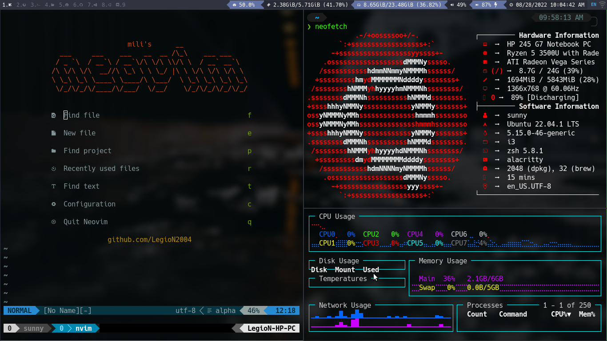
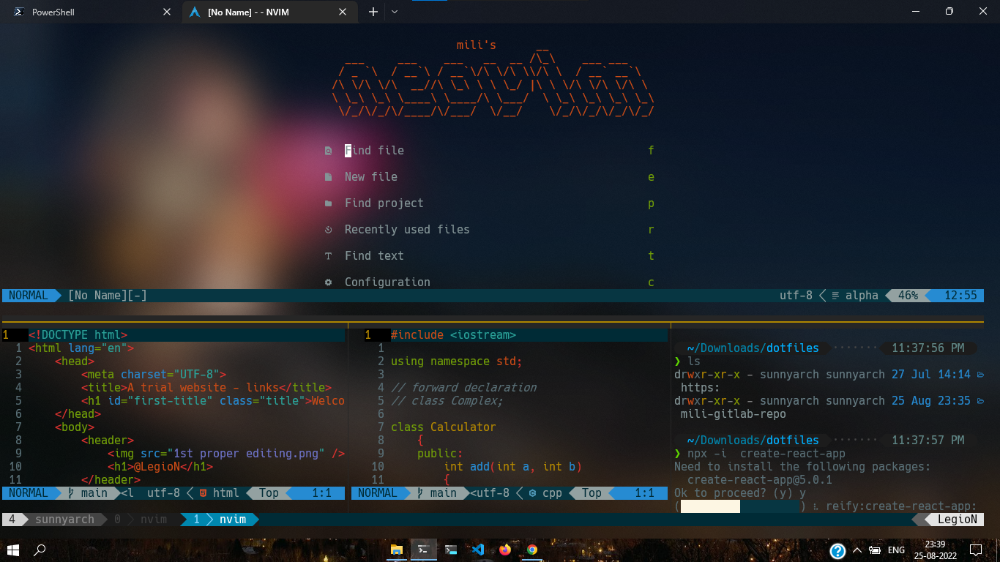

# dotfiles
my dotfiles for ubuntu and windows machine
## Here is an image of my setup of neovim, tmux, and i3wm 

You can also use this in wsl2

My neovim is highly inspired by  neovim for the aesthetics so credits goes to him (I liked his setup too much but) maximum of the configuration is written by me from scratch to make neovim look and feel the way it is shown in the pics

This is a backup of my dotfiles for my ubuntu and windows machine  . Feel free to copy any xmonad , i3 or neovim config if you like em , i also have some config files for other foss softwares . :)

I will make the readme better once I get hold of how to use  markdown for better preview of my dotflies

You can directly copy my neovim config and add it to the .config folder for unix systems and it will automatically set up everything for you 
